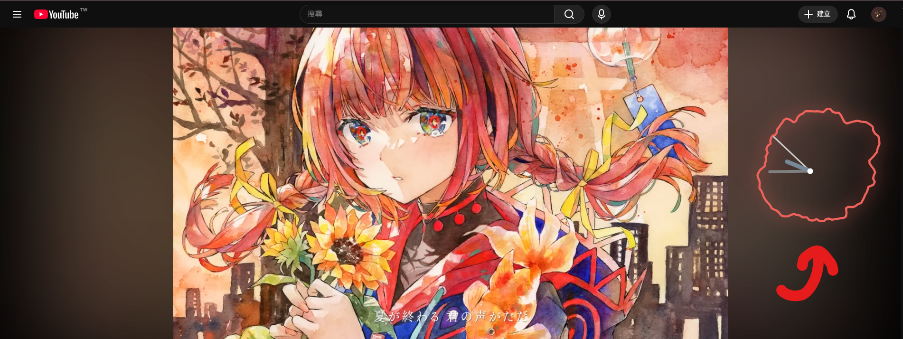

## Virtual Music Clock

A desktop-grade audio visualization utility built with Electron and Next.js, featuring high-DPI transparent rendering, dynamic color mapping, and treble-sensitive glitch effects.

## Preview

## Why I Made This

I built th same project using p5.js and electron 5 years ago without AI. This project is the restructure one. Using totally different techs such as websocket, also with gemini. But the core fft method is the same.

## Features

- 3-Tier Decoupled Architecture: The system is split into three core modules: the Visual Terminal, the Audio Engine Worker, and a Local WebSocket Hub. This design ensures that heavy FFT (Fast Fourier Transform) calculations never block the UI rendering thread, maintaining a rock-solid 60FPS experience.

- High-DPI Sharp Rendering: The system automatically detects the Device Pixel Ratio (DPR) and dynamically scales the Canvas's physical pixel dimensions. This ensures that clock lines and glows remain pin-sharp on 4K or Retina displays without any blurring or artifacts.

- Dynamic HSL Color Mapping: Moving beyond static color toggles, the visualizer maps audio bass energy to the HSL color space. As the music intensifies, the hue and lightness shift fluidly from a signature "Miku Green" to vibrant cyan and deep blues, creating a living, breathing interface.

- Treble-Triggered Glitch Effects: Built-in real-time treble detection logic monitors high-frequency peaks. When sharp audio triggers occur (such as hi-hats or electronic synths), the clock area undergoes localized horizontal slicing and chromatic aberration effects, adding a rhythmic "shatter" impact to the visuals.

- Smooth Linear Interpolation (Lerp): All spectral data undergoes linear interpolation to absorb sudden zeros or erratic jumps in audio sampling. This results in a spectrum ring that expands and contracts with organic, fluid elasticity.

## Tech Stack

- Framework: Electron + Next.js (App Router)

- Communication: Local WebSocket (ws) for cross-window data broadcasting

- Audio Engine: Native Web Audio API for FFT Analysis

- Graphics: HTML5 Canvas API with hardware-accelerated post-processing

## Install

npm install ws

npm install electron concurrently wait-on --save-dev
